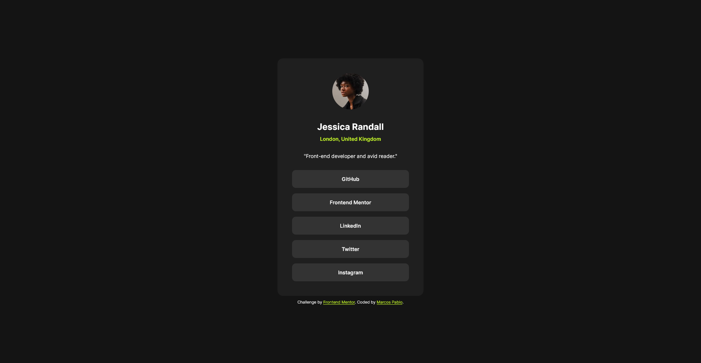

# Frontend Mentor - Social links profile solution

This is a solution to the [Social links profile challenge on Frontend Mentor](https://www.frontendmentor.io/challenges/social-links-profile-UG32l9m6dQ). Frontend Mentor challenges help you improve your coding skills by building realistic projects. 

## Table of contents

- [Overview](#overview)
  - [The challenge](#the-challenge)
  - [Screenshot](#screenshot)
- [My process](#my-process)
  - [Built with](#built-with)
  - [What I learned](#what-i-learned)
- [Author](#author)

## Overview

### The challenge

Users should be able to:

- See hover and focus states for all interactive elements on the page

### Screenshot

## My process

### Built with

- Semantic HTML5 markup
- CSS custom properties
- Flexbox

### What I learned

I reinforced my basic knowledge of html and css and the challenge of trying to deliver a result as close as possible to what was in the reference images, but without having the reference measurements, such as width, height and margins, it was very challenging to get a result as close as possible to what was shown without these measurements and it allowed me to work on my eyesight, the ability to be able to identify the size of a measurement just by looking at it.

## Author

- Frontend Mentor - [@Marcos-Pablo-Dev](https://www.frontendmentor.io/profile/Marcos-Pablo-Dev)
